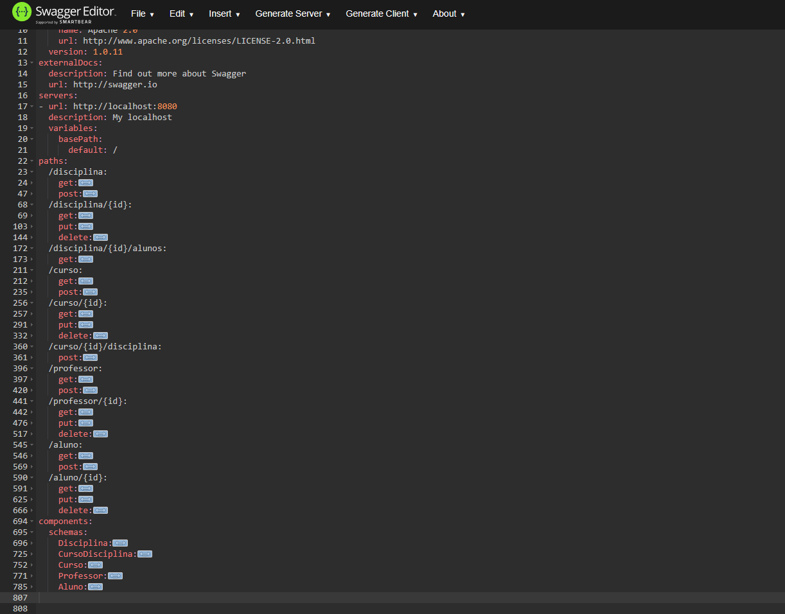

# C3 : Desenvolvimento

O desenvolvimento da API procurou utilizar  os conhecimentos lecionados na Disciplina de Desenvolvimento WEB I, bem como as ferramentas/aplicações indicadas na mesma.

Após a escolha do tema e dos recursos  foi usado o Swagger Editor online, para criar manualmente a documentaçao da API,  ou seja descrever os recursos da API, metodos, dados retornados codigos HTTP entre  outros.
O resultado foi a criaçao de  um ficheiro tipo YAML que permitiu a criaçao de  um servidor (nodeJs-server)

Em cumprimento do requisitos do projeto e após a construção dos métodos (get, post, put, delete), foi usado a plataforma Docker, que proporciona a virtualização dos aplicativos utilizando o conceito de containers. 
No projeto em causa foram criados o ficheiro docker.compose.yml que onde foram configurados os serviços do aplicativo de modo podermos utilizar a ferramenta Docker Compose para a criaçao das  imagens e containers que vai usar também os ficheiros dockerfile e dockerfile.mysql.

O resultado foi a criaçao de duas imagens (inf22dw1g24/school-app e inf22dw1g24/school-mysql)  dois _containers_ (scholl-app e school-mysql) bem como um _volume_. (ver imagens [/doc/images/Docker](https://github.com/INF22DWIG24/ReportDW1/tree/main/doc/images/Docker))

Para testar a a API REST  foi utilizado  o aplicativo  Postman, através da execução dos metodos da API e observaçao dos resultados.(ver imagens em [/doc/images/Postman](https://github.com/INF22DWIG24/ReportDW1/tree/main/doc/images/Postman))

---
[< Previous](c2.md) | [^ Main](../../../) |
 
